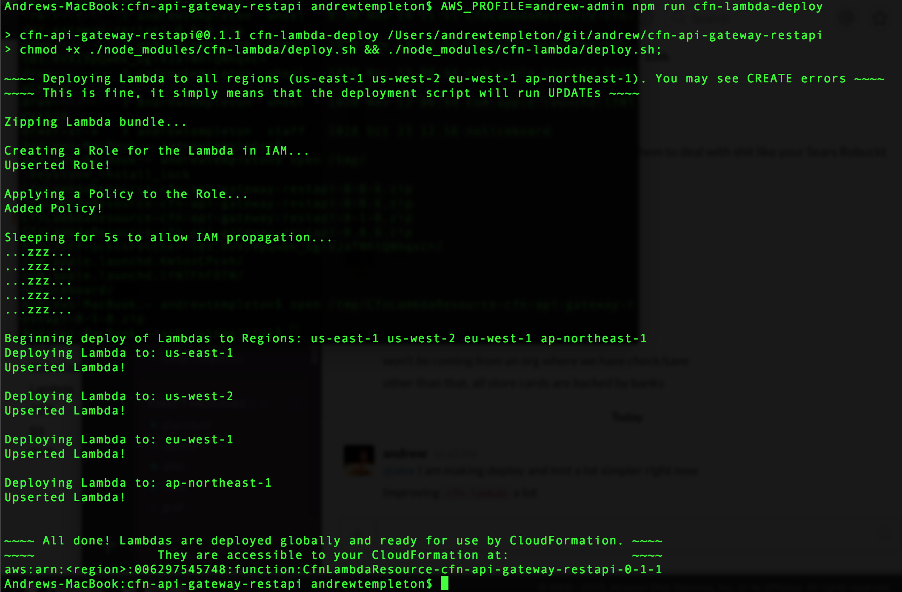

# cfn-lambda


## Purpose

A simple flow for generating CloudFormation Lambda-Backed Custom Resource handlers in node.js. The scope of this module is to structure the way developers author simple Lambda-Backed resources into simple functional definitions of `Create`, `Update`, `Delete`.

Also supports:
 - Automatic expansion of `__default__` `Properties` values into any tree or subtree of any Custom Resource utilizing `cfn-lambda` for implementation 
 - Validation of `'ResourceProperties'`
   + Using inline JSONSchema objects as `Schema`
   + Using a `SchemaPath` to JSONSchema file
   + Using a custom `Validate` callback
 - Optional `NoUpdate` callback, which runs as a READ function for when `Update` should be made due to all parameters being identical - because some resources still need to return attributes for `Fn::GetAtt` calls.
 - Convenience `Environment` values
   + Lambda ARN
   + Lambda Name
   + AWS Account ID for the Lambda
   + Region for the Lambda
 - Array of String `TriggersReplacement` for `Resource.Properties` key strings that force delegation to resource `Create` for seamless full replacement without downtime in many cases, and forcing `UPDATE_COMPLETE_CLEANUP_IN_PROGRESS`.
 - An `SDKAlias` function generator that structures and greatly simplifies the development of custom resources that are supported by the Node.js `aws-sdk` but not supported by CloudFormation.
 

[This package on NPM](https://www.npmjs.com/package/cfn-lambda)  
[This package on GitHub](https://www.github.com/andrew-templeton/cfn-lambda)


## Examples

 - *Stable* `Custom::ApiGatewayRestApi` ([GitHub](https://github.com/andrew-templeton/cfn-api-gateway-restapi) / [NPM](https://www.npmjs.com/package/cfn-api-gateway-restapi))
 - *Stable* `Custom::ApiGatewayMethod` ([GitHub](https://github.com/andrew-templeton/cfn-api-gateway-method) / [NPM](https://www.npmjs.com/package/cfn-api-gateway-method))
 - *Stable* `Custom::ApiGatewayMethodResponse` ([GitHub](https://github.com/andrew-templeton/cfn-api-gateway-method-response) / [NPM](https://www.npmjs.com/package/cfn-api-gateway-method-response))
 - *Beta* `Custom::ApiGatewayDeployment` ([GitHub](https://github.com/andrew-templeton/cfn-api-gateway-deployment) / [NPM](https://www.npmjs.com/package/cfn-api-gateway-deployment))
 - *Alpha* `Custom::ApiGatewayStage` ([GitHub](https://github.com/andrew-templeton/cfn-api-gateway-stage) / [NPM](https://www.npmjs.com/package/cfn-api-gateway-stage))


## Deployment of Lambdas

Any custom resource using this tool as a dependency can run this deploy script from the root of the custom resource project to deploy Lambdas to all regions. Add this line to the `"scripts"` section of your `package.json` inside your repository using this module as a direct dependency:

    "cfn-lambda-deploy": "node ./node_modules/cfn-lambda/deploy.js"

You can also deploy the Lambdas programmatically like so:

                                          (cfn-module)      (default region) (regions)  (callback)
    node -e "require('cfn-lambda').deploy('cfn-yourmodule', 'us-east-1', ['us-east-1'], null);"

You must also set up:

1. Add `<reporoot>/execution-policy.json` to define the abilities the Lambda should have.
2. Have AWS credentials configured in your environment, via one of:
  + `$AWS_PROFILE` in your environment
  + a credentials file
  + `$AWS_ACCESS_KEY_ID` and `$AWS_SECRET_ACCESS_KEY` in your environment.


You then run this from within the repository directly depending on `cfn-lambda`:

    $ npm run cfn-lambda-deploy


It should look like this: 





## Usage

This is a contrived example call to fully demonstrate the way to interface with the creation API.

You can manually define these properties, or use `SDKAlias` for `Create`, `Update` and/or `Delete`. 


### Resource Lambda Generation
```
var CfnLambda = require('cfn-lambda');


exports.handler = CfnLambda({

  Create: Create, // Required function
  Update: Update, // Required function
  Delete: Delete, // Required function

  // Any of following to validate resource Properties
  // If you do not include any, the Lambda assumes any Properties are valid.
  // If you define more than one, the system uses all of them in this order.
  Validate: Validate,     // Function
  Schema: Schema,         // JSONSchema v4 Object
  SchemaPath: SchemaPath, // Array path to JSONSchema v4 JSON file
  // end list

  NoUpdate: NoUpdate, // Optional
  TriggersReplacement: TriggersReplacement, // Array<String> of properties forcing Replacement

  LongRunning: <see Long Running below> // Optional. Configure a lambda to last beyond 5 minutes.

});
```

### `Environment` Convenience Property

Provides convenience `Environment` values.: 

    var CfnLambda = require('cfn-lambda');
    // After receiving `event` and `context`...
    console.log(CfnLambda.Environment);
    /*
    {
      `LambdaArn`: 'foo bar',      // Full ARN for the current Lambda
      `Region`: 'us-east-1',       // Region in which current Lambda resides
      `AccountId`: '012345678910', // The account associated with the Lambda
      `LambdaName`: 'LambdaName'   // Name for the current Lambda
    }
    */


*Only works after the generated `CfnLambda` function has been called by Lambda.*


#### `Create` Method Handler

Called when CloudFormation issues a `'CREATE'` command.  
Accepts the `CfnRequestParams` Properties object, and the `reply` callback.

```
function Create(CfnRequestParams, reply) {
  // code...
  if (err) {
    // Will fail the create.
    // err should be informative for Cfn template developer.
    return reply(err);
  }
  // Will pass the create.
  // physicalResourceId defaults to the request's `[StackId, LogicalResourceId, RequestId].join('/')`.
  // FnGetAttrsDataObj is optional.
  reply(null, physicalResourceId, FnGetAttrsDataObj);
}
```
#### `Update` Method Handler

Called when CloudFormation issues an `'UPDATE'` command.  
Accepts the `RequestPhysicalId` `String`, `CfnRequestParams` Properties object, the `OldCfnRequestParams` Properties object, and the `reply` callback.

```
function Update(RequestPhysicalID, CfnRequestParams, OldCfnRequestParams, reply) {
  // code...
  if (err) {
    // Will fail the update.
    // err should be informative for Cfn template developer.
    return reply(err);
  }
  // Will pass the update.
  // physicalResourceId defaults to pre-update value.
  // FnGetAttrsDataObj is optional.
  reply(null, physicalResourceId, FnGetAttrsDataObj);
}
```

#### `Delete` Method Handler

Called when CloudFormation issues a `'DELETE'` command.  
Accepts the `RequestPhysicalId` `String`, `CfnRequestParams` Properties object, and the `reply` callback.

```
function Delete(RequestPhysicalID, CfnRequestParams, reply) {
  // code...
  if (err) {
    // Will fail the delete (or rollback).
    // USE CAUTION - failing aggressively will lock template,
    //   because DELETE is used during ROLLBACK phases.
    // err should be informative for Cfn template developer.
    return reply(err);
  }
  // Will pass the delete.
  // physicalResourceId defaults to pre-delete value.
  // FnGetAttrsDataObj is optional.
  reply(null, physicalResourceId, FnGetAttrsDataObj);
}
```

### Validating Properties

Used before `'CREATE'`, `'UPDATE'`, or `'DELETE'` method handlers. The CloudFormation request will automatically fail if any truthy values are returned, and any `String` values returned are displayed to the template developer, to assist with resource `Properties` object correction.

*Important:* To prevent `ROLLBACK` lockage, the `'DELETE'` will be short circuited if this check fails. If this check fails, CloudFormation will be told that everything went fine, but no actual further actions will occur. This is because CloudFormation will immediately issue a `'DELETE'` after a failure in a `'CREATE'` or an `'UPDATE'`. Since these failures themselves will have resulted from a validation method failure if the subsequent `'DELETE'` fails, this is safe.

May be a:
 - Custom validation function as `Validate` callback
 - JSONSchema v4 `Schema`
 - JSONSchema v4 file path as `SchemaPath`

#### `Validate` Method Handler

The truthy `String` return value will cause a `'FAILURE'`, and the `String` value is used as the CloudFormation `'REASON'`.

```
// Example using a custom function
// CfnRequestParams are all resource `Properties`,
//   except for the required system `ServiceToken`.
function Validate(CfnRequestParams) {
  // code...
  if (unmetParamCondition) {
    return 'You must blah blah include a parameter... etc'
  }
  if (someOtherCondition) {
    return 'Informative message to CFN template developer goes here.'
  }
  // Returning a falsey value will allow the action to proceed.
  // DO NOT return truthy if the request params are valid.
}
```

#### `Schema` Object - JSONSchema Version 4

Using a JSONSchema `Schema` property value will automatically generate the `String` invalidation return values for you when validating against the parameters - simply provide the template and the validation and error messging is taken care of for you.

If you choose to use a JSONSchema template, the service will also use the JSONSchema metaschema to ensure the provided JSONSchema is a valid schema itself.

```
// Example using a custom JSONSchema Version 4 template
// This might be in a file you manually load like `schema.json`, or a JS object.
var Schema = {
  type: 'object',
  required: [
    'foo'
  ],
  properties: {
    foo: {
      type: 'string'
    },
    selectable: {
      type: 'string',
      enum: ['list', 'of', 'valid', 'values']
    }
  },
  additionalProperties: false
};
```

#### `SchemaPath` Array - Path to JSONSchema Version 4 File

A convenient way to get the benefits of `Schema` object validation, but keeping your code clean and segregated nicely.

The path is defined as an Array so that we can use the `path` module.

```
var SchemaPath = [__dirname, 'src', 'mytemplate.json'];
```


#### `NoUpdate` Method Handler

Optional. Triggered by deep JSON object equality of the old and new parameters, if defined.

Even when short-circuiting an `Update` is a good idea, a resource provider may still need to return a set of properties for use with `Fn::GetAtt` in CloudFormation templates. This `NoUpdate` handler triggers in the special case where no settings on the resource change, allowing the developer to simultaneously skip manipulation logic while doing read operations on resources to generate the attribute sets `Fn::GetAtt` will need.

``` 
// Using a custom NoUpdate for READ to supply properties
//   for Fn::GetAtt to access in CloudFormation templates
function NoUpdate(PhysicalResourceId, CfnResourceProperties, reply) {
  // code that should be read-only if you're sane...
  if (errorAccessingInformation) {
    return reply('with an informative message');
  }
  // Can have many keys on the object, though I only show one here
  reply(null, PhysicalResourceId, {Accessible: 'Attrs object in CFN template'});
}
```


## Long Running

*This is very advanced Lambda self replication.*

The inner workings of this feature are a lot to take in. I strongly suggest you just read the source code for `cfn-elasticsearch-domain` to see how the `index.js` file utilizes the `LongRunning` feature, as the concrete example code is much more understandable than abstract definitions of parameters and options.

`cfn-elasticsearch-domain/index.js` [GitHub](https://www.github.com/andrew-templeton/cfn-elasticsearch-domain/blob/master/index.js)

*If you have the appetite for it... Read on...*

Some resources will take a considerable amount of time to complete, like an Elasticsearch Domain. In order to utilize Lambda-Backed Custom Resources within CloudFormation while avoiding the hard 300 second / 5 minute Lambda timeout for resources that will take more than 5 minutes to finish, `cfn-lambda` allows resource developers to leverage bundled Lambda self-replication logic. Developers can configure the `LongRunning` property on the lambda definition options object with a few settings to tell `cfn-lambda` to simply run some action initialization code (such as initiating an Elasticsearch Domain Create), then periodically self-replicate to check the status of the long-running process. The majority of cases where AWS APIs or SDKs return `statusCode === 202` will use this technique to avoid Lambda death at 5 minutes.

The self-replication strategy will trigger if the developer configures the following on the LongRunning property object: `PingInSeconds`, `MaxPings`, `LambdaApi`, `Methods.METHOD_NAME`.

##### PingInSeconds

The duration a Lambda will wait between spawning self-replication calls and triggering the next `LongRunning.Methods.METHOD_NAME` call. This value should not exceed `240` (4 minutes), because we need to leave enough time before the 5 minute hard process death is triggered by AWS.

After this time, the lambda will spawn a new lambda, which will call the `LongRunning.Method.METHOD_NAME`, where `METHOD_NAME` is `Create`, `Delete`, `Update`, depending on which are configured and the lifecycle phase the resource is moving through.

##### MaxPings

The maximum number of self-respawn and check cycles the Lambda will go through. After exceeding this number, the Lambda will circuit break and send a `Failed to Stabilize` response to the CloudFormation stack.

##### LambdaApi

`cfn-lambda` uses this namespace to invoke the Lambda. Allows the Custom Resource developer using `cfn-lambda` to specify a Lambda API version, or stub the value out for testing.

In most cases, just pass `new AWS.Lambda({apiVersion: '2015-03-31'})` as the API namespace.

##### Methods

Most of the `LongRunning` logic happens here. At its most configured, this subobject will have 3 properties corresponding to the normal actions: `Create`, `Update`, and `Delete`. 

When you configure one of these properties, the flow of that CloudFormation action type changes - within the `reply` callback function in the corresponding normal/top-level callback you defined for the resource, `reply`-ing with success just tells `cfn-lambda` that you correctly initialized the `Create`/`Delete`/`Update` for the resource, and to start using the corresponding `LongRunning.Methods.METHOD` to ping to final completion. That is, the resource will not `COMPLETE` the action until the function you define finalizes the `SUCCESS`.

Read below to see how to define each `LongRunning.Methods.METHOD`...

#### `LongRunningContext` Param Object

All three `LongRunning.Methods` receive a special object as their first parameter. The `LongRunningContext` object carries useful state across all spawned lambda ping cycles.

 - `LongRunningContext.RawResponse`: carries the original intercepted call that your first Create initialization call tried to send to CloudFormation. Used internally for state manipulation. DO NOT ALTER THIS VALUE unless you *really* know what you're doing, as tampering can cause Lambda recursion to spiral out of control!
 - `LongRunningContext.PhysicalResourceId`: Carries the original `PhysicalResourceId` intercepted call that your first Create initialization call tried to send to CloudFormation. Useful if your check functions need this value and cannot recompute it from the `ResourceProperties` sent by CloudFormation.
 - `LongRunningContext.Data`: Carries the original data hash, if present, intercepted from your call to `reply` within the initializer method. Useful if your check functions need these data value(s) and cannot recompute them from the `ResourceProperties` sent by CloudFormation. Will not be present if you did not pass a third parameter to `reply` in the initializer, since the `GetAtt`-usable `Data` hash is optional in `cfn-lambda`.
 - `LongRunningContext.PassedPings`: The number of ping spawns before this current run that have occurred. DO NOT ALTER THIS NUMBER! Subtracting from this number will make your Lambdas infinitely self-replicate, *very very bad*!


#### `LongRunning.Methods.Create`

Will be called during Lambda pingspawn cycles. Here, `CheckCreate` is an example of a check function definition for `LongRunning.Methods.Create`.

```
function CheckCreate(LongRunningContext, params, reply, notDone) {
  // LongRunningContext is object type specified above
  // params are Properties straight from CloudFomation
  // reply is callback just like in normal Create,
  //    call it with reply(errMsg) or reply(null, physicalId, AttrHash)
  // notDone takes no parameters, use this to tell 
  //   cfn-lambda to use another ping/spawn cycle and check again later
}
```

#### `LongRunning.Methods.Update`

Will be called during Lambda pingspawn cycles. Here, `CheckUpdate` is an example of a check function definition for `LongRunning.Methods.Update`.

```
function CheckUpdate(LongRunningContext, physcialId, params, oldParams, reply, notDone) {
  // LongRunningContext is object type specified above
  // physicalId is PhysicalResourceId from pre-Update resource state
  // params are Properties straight from CloudFomation
  // oldParams are Properties from CloudFormation for before the Update began
  // reply is callback just like in normal Update,
  //    call it with reply(errMsg) or reply(null, physicalId, AttrHash)
  //    to finalize the transition and notify CloudFormation.
  // notDone takes no parameters, use this to denote no errors and tell 
  //   cfn-lambda to use another ping/spawn cycle and check again later
}
```

#### `LongRunning.Methods.Delete`

Will be called during Lambda pingspawn cycles. Here, `CheckDelete` is an example of a check function definition for `LongRunning.Methods.Delete`.

```
function CheckDelete(LongRunningContext, physcialId, params, reply, notDone) {
  // LongRunningContext is object type specified above
  // physicalId is PhysicalResourceId from pre-Delete resource state
  // params are Properties straight from CloudFomation
  // reply is callback just like in normal Delete,
  //    call it with reply(errMsg) or reply(null, physicalId, AttrHash)
  //    to finalize the transition and notify CloudFormation.
  // notDone takes no parameters, use this to denote no errors and tell 
  //   cfn-lambda to use another ping/spawn cycle and check again later
}
```


## `TriggersReplacement` Array

Optional. Tells `cfn-lambda` to divert the `'Update'` call from CloudFormation to the `Create` handler the developer assigns to the Lambda. This technique results in the most seamless resource replacement possible, by causing the new resource to be created before the old one is deleted. This `Delete` cleanup process occurs in the `UPDATE_COMPLETE_CLEANUP_IN_PROGRESS` phase after all new resources are created. This property facilitates triggering that said phase.

```
exports.handler = CfnLambda({
  // other properties
  TriggersReplacement: ['Foo', 'Bar'],
  // other properties
});
```

Now, if the Lambda above ever detects a change in the value of `Foo` or `Bar` resource Properties on `Update`, the Lambda will delegate to a two-phase `Create`-new-then-`Delete`-old resource replacement cycle. It will use the `Create` handler provided to the same `CfnLambda`, then subsequently the prodvided `Delete` if and only if the `Create` handler sends a `PhysicalResourceId` different from the original to the `reply` callback in the handler.


## `SDKAlias` Function Generator

Structures and accelerates development of resources supported by the `aws-sdk` (or your custom SDK) by offering declarative tools to ingest events and proxy them to AWS services.

Will automatically correctly ignore `ServiceToken` from CloudFormation Properties. All settings are optional, except `api` and `method`.

##### Usage Reference
```
var AWS = require('aws-sdk');
var AnAWSApi = new AWS.SomeNamespace();
var CfnLambda = require('cfn-lambda');
// Then used as the Create property as defined in Usage above
var MyAliasActionName = CfnLambda.SDKAlias({ // Like Create, Update, Delete
  returnPhysicalId: 'KeyFromSDKReturn' || function(data) { return 'customValue'; }, 
  downcase: boolean, // Downcase first letter of all top-level params from CloudFormation
  api: AnAWSApi, // REQUIRED
  method: 'methodNameInSDK', // REQUIRED
  mapKeys: {
    KeyNameInCfn: 'KeyNameForSDK'
  },
  forceBools: [ // CloudFormation doesn't allow Lambdas to recieve true booleans.
    'PathToCfnPropertyParam',     // This will coerce the parameter at this path.
    'Also.Supports.Wildcards.*',
    'But',
    'only.at.path.end'
  ],
  keys: [ // Defaults to including ALL keys from CloudFormation, minus ServiceToken
    'KeysFrom',
    'CloudFormationProperties',
    'ToPassTo',
    'TheSDKMethod',
    '**UsedBeforeMapKeys**'
  ],
  returnKeys: [
    'KeysFrom',
    'SDKReturnValue',
    'ToUseWithCfn',
    'Fn::GetAttr'
  ],
  ignoreErrorCodes: [IntegerCodeToIgnore, ExWouldBe404ForDeleteOps],
  physicalIdAs: 'UsePhysicalIdAsThisKeyInSDKCall', 
});

// Then...

exports.handler = CfnLambda({
  Create: MyAliasActionName, // Doesn't have to be Create, can be Update or Delete
  // ...
});
```

## Defaults

Sometimes it is advantageous to be able to reuse JSON objects or fragments of JSON objects in `Properties` of Custom Resources, like when you need to build similar complex/large resources frequently that differ by only a few properties.

Any module using `cfn-lambda` supports `__default__` property expansion. `__default__` can be added anywhere in the `Properties` object for a resource, with `__default__` containing an arbitrary `JSON/String/Array/null/Number` value serialized using `toBase64(JSON.stringify(anyObject))`. `cfn-lambda` will expand these properties *before* hitting any validation checks, by running `JSON.parse(fromBase64(encodedDefault))` recursively, and overwriting any values in the `__default__` tree with those actually set on the `Properties` object.

The best example of this is the `cfn-variable` module's `example.template.json`, wherein a very large `RestApi` is created with over a large repeated subtree of `Resource` objects. `cfn-variable` is a custom resource that takes any value and serializes it using `toBase64(JSON.stringify(anyValue))`, making it a perfect fit for this behavior. 

In the example in `cfn-variable`, this technique is used to create 120 `Resource` objects in under 15 seconds (this example uses less):
```
// This is cfn-variable storing the serialized object:
"MySubtreeVariable": {
  "Type": "Custom::Variable",
  "Properties": {
    "ServiceToken": {
      "Fn::Join": [
        ":",
        [
          "arn",
          "aws",
          "lambda",
          {
            "Ref": "AWS::Region"
          },
          {
            "Ref": "AWS::AccountId"
          },
          "function",
          {
            "Ref": "VariableCustomResourceName"
          }
        ]
      ]
    },
    "VariableValue": {
      "ChildResources": [
        {
          "PathPart": "a",
          "ChildResources": [
            {
              "PathPart": "aa",
              "ChildResources": [
                {
                  "PathPart": "aaa"
                },
                {
                  "PathPart": "aab"
                },
                {
                  "PathPart": "aac"
                }
              ]
            },
            {
              "PathPart": "ab",
              "ChildResources": [
                {
                  "PathPart": "aba"
                },
                {
                  "PathPart": "abb"
                },
                {
                  "PathPart": "abc"
                }
              ]
            },
            {
              "PathPart": "ac",
              "ChildResources": [
                {
                  "PathPart": "aca"
                },
                {
                  "PathPart": "acb"
                },
                {
                  "PathPart": "acc"
                }
              ]
            }
          ]
        }
      ]
    }
  }
},
// Then this will make the tree 3x because you used a variable with __default__
"ExpandedResourceTree": {
  "DependsOn": [
    "MyRestApi",
    "MyVariable"
  ],
  "Type": "Custom::ApiGatewayResourceTree",
  "Properties": {
    "ServiceToken": "<the token>",
    "RestApiId": {
      "Ref": "MyRestApi"
    },
    "ParentId": {
      "Fn::GetAtt": [
        "MyRestApi",
        "RootResourceId"
      ]
    },
    "ChildResources": [
      {
        "PathPart": "alpha",
        "__default__": {
          "Fn::GetAtt": [
            "MySubtreeVariable",
            "Value"
          ]
        }
      },
      {
        "PathPart": "beta",
        "__default__": {
          "Fn::GetAtt": [
            "MySubtreeVariable",
            "Value"
          ]
        }
      },
      {
        "PathPart": "gamma",
        "__default__": {
          "Fn::GetAtt": [
            "MySubtreeVariable",
            "Value"
          ]
        }
      }
    ]
  }
}
```
